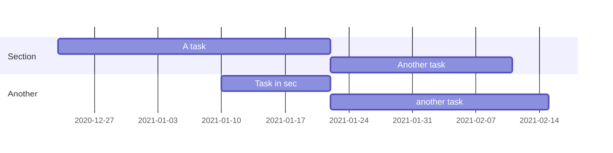
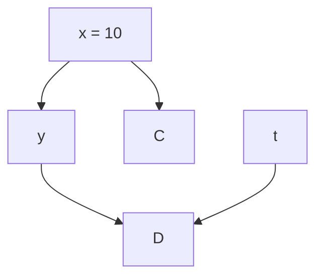

---
# Page title
title: An Example Chapter

# Title for the menu link if you wish to use a shorter link title, otherwise remove this option
linktitle: "1.2 Example Chapter"

# Page summary for search engine
summary: Blah, blah, blah for page 2

# Date page published
date: 2020-12-23

# Academic page type (do not modify)

type: book

# Position of this page in the menu. Remove this option to sort alphabetically
weight: 1

---

This is written for example page 2 of first chapter/lecture of machine learning course.


## Heading of section 2

We begin this section with a block quote:

> I am a blockquote. I don't know who quoted me.


A todo list can be made as:
```
- [x] Write course lecture notes.
- [ ] Include Latex math in the notes.
- [ ] Deploy the notes on course website.
- [x] Do something useful.
```
and it gives

- [x] Write course lecture notes.
- [ ] Include Latex math in the notes.
- [ ] Deploy the notes on course website.
- [x] Do something useful.


Lorem ipsum dolor sit amet, consectetur adipiscing elit. Duis posuere tellus ac convallis placerat. Proin tincidunt magna sed ex sollicitudin condimentum. Sed ac faucibus dolor, scelerisque sollicitudin nisi. 

Let's put some images now. 

First, an image is taken from the current folder.





Cras purus urna, suscipit quis sapien eu, pulvinar tempor diam. Quisque risus orci, mollis id ante sit amet, gravida egestas nisl. Sed ac tempus magna. Proin in dui enim. Donec condimentum, sem id dapibus fringilla, tellus enim condimentum arcu, nec volutpat est felis vel metus. Vestibulum sit amet erat at nulla eleifend gravida.

## Code Highlighting

I have used `highlight_style = "brown-paper"` in the following code highlighting.

```python
# An example of python code highlighting
def data_summary(X_train, y_train, X_test, y_test):
    """Summarize current state of dataset"""
    print('Train images shape:', X_train.shape)
    print('Train labels shape:', y_train.shape)
    print('Test images shape:', X_test.shape)
    print('Test labels shape:', y_test.shape)
    print('Train labels:', y_train)
    print('Test labels:', y_test) 
```

Nullam vel molestie justo. Curabitur vitae efficitur leo. In hac habitasse platea dictumst. Sed pulvinar mauris dui, eget varius purus congue ac. Nulla euismod, lorem vel elementum dapibus, nunc justo porta mi, sed tempus est est vel tellus. Nam et enim eleifend, laoreet sem sit amet, elementum sem. Morbi ut leo congue, maximus velit ut, finibus arcu. In et libero cursus, rutrum risus non, molestie leo. Nullam congue quam et volutpat malesuada. Sed risus tortor, pulvinar et dictum nec, sodales non mi. Phasellus lacinia commodo laoreet. Nam mollis, erat in feugiat consectetur, purus eros egestas tellus, in auctor urna odio at nibh. Mauris imperdiet nisi ac magna convallis, at rhoncus ligula cursus.


```python
x = 20
y = 30
z = x + y
print('x = {} + y = {} = {}'.format(x,y,z))
```

Apart from code `highlighting`, one can draw `diagrams` of different types. Here is an example of **Gantt Chart**:



This is an example of a typical flow chart:



Cras aliquam rhoncus ipsum, in hendrerit nunc mattis vitae. Duis vitae efficitur metus, ac tempus leo. Cras nec fringilla lacus. Quisque sit amet risus at ipsum pharetra commodo. Sed aliquam mauris at consequat eleifend. Praesent porta, augue sed viverra bibendum, neque ante euismod ante, in vehicula justo lorem ac eros. Suspendisse augue libero, venenatis eget tincidunt ut, malesuada at lorem. Donec vitae bibendum arcu. Aenean maximus nulla non pretium iaculis. Quisque imperdiet, nulla in pulvinar aliquet, velit quam ultrices quam, sit amet fringilla leo sem vel nunc. Mauris in lacinia lacus.

Suspendisse a tincidunt lacus. Curabitur at urna sagittis, dictum ante sit amet, euismod magna. Sed rutrum massa id tortor commodo, vitae elementum turpis tempus. Lorem ipsum dolor sit amet, consectetur adipiscing elit. Aenean purus turpis, venenatis a ullamcorper nec, tincidunt et massa. Integer posuere quam rutrum arcu vehicula imperdiet. Mauris ullamcorper quam vitae purus congue, quis euismod magna eleifend. Vestibulum semper vel augue eget tincidunt. Fusce eget justo sodales, dapibus odio eu, ultrices lorem. Duis condimentum lorem id eros commodo, in facilisis mauris scelerisque. Morbi sed auctor leo. Nullam volutpat a lacus quis pharetra. Nulla congue rutrum magna a ornare.

Aliquam in turpis accumsan, malesuada nibh ut, hendrerit justo. Cum sociis natoque penatibus et magnis dis parturient montes, nascetur ridiculus mus. Quisque sed erat nec justo posuere suscipit. Donec ut efficitur arcu, in malesuada neque. Nunc dignissim nisl massa, id vulputate nunc pretium nec. Quisque eget urna in risus suscipit ultricies. Pellentesque odio odio, tincidunt in eleifend sed, posuere a diam. Nam gravida nisl convallis semper elementum. Morbi vitae felis faucibus, vulputate orci placerat, aliquet nisi. Aliquam erat volutpat. Maecenas sagittis pulvinar purus, sed porta quam laoreet at.

